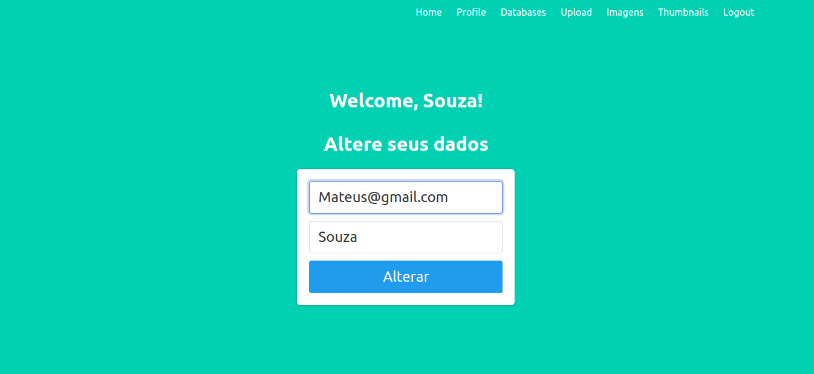

# FLASK_IMAGE

Projeto desenvolvido para aplicação de conhecimentos obtidos através dos estudos da linguagem python e o framework flask.

## FUNCIONALIDADES

- Login
- Autenticação de Usuários
- Alteração no perfil do usuário
- Upload de Imagens
- Gerenciamento de Imagens
- Thumbnails das imagens cadastradas

## INSTALAÇÃO DO PROJETO

`OBS: É necessário ter um ambiente de desenvolvimento python instalado na maquina local.`

- [Python 3.9](https://www.python.org/downloads/)
- [Visual Studio Code](https://code.visualstudio.com/download)

### COMANDOS PARA ATIVAÇÃO DO AMBIENTE DE DESENVOLVIMENTO

`OBS: Estes comandos devem ser rodados no terminal, no diretório do projeto.`

- [Instalação] `pip install virtualenv`

- [Criação] `python3 -m venv my_env`

- [Ativação] `source my_env/bin/activate`

- [Raiz] `export FLASK_APP=project`

- [Debug] `export FLASK_DEBUG=1`

- [Execução] `flask run`

## SCRENNSHOTS

### Home

### Signup

### Login

### Profile

### Upload

### Gerenciamento de Imagens

## Autor

Mateus Souza de Jesus, Analista e desenvolvedor de sistemas, apaixonado por tecnologia e muito entusiasta da linguagem python e framework flask.

